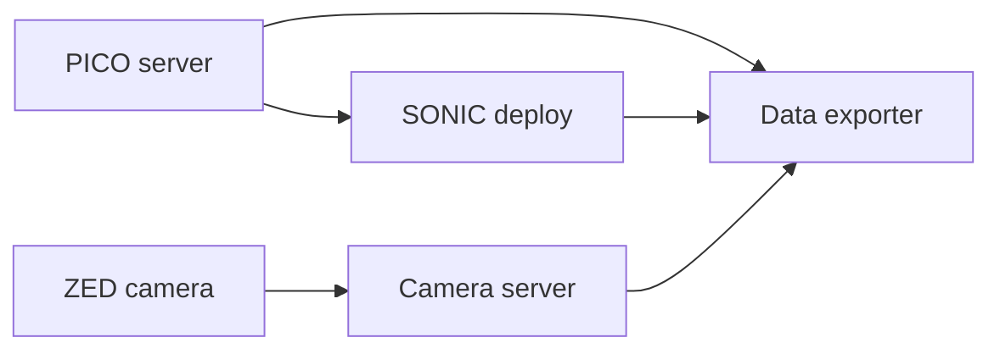

# Data Collection for VLA

Record teleop demonstrations as [LeRobot](https://github.com/huggingface/lerobot) datasets for post-training with [Isaac-GR00T](https://github.com/NVIDIA/Isaac-GR00T). The data exporter runs alongside the SONIC deployment and VR teleop stack, capturing robot state, SMPL teleop poses, and camera images at a configurable frequency.

```{admonition} Deployment model
:class: important
Run the camera server on the computer physically connected to the cameras. In the Thor setup, the C++ deployment, PICO server, camera server, data exporter, and viewer all run from the same repo clone on Thor; use `localhost` for their ZMQ connections. No camera process is needed on the G1 Orin.
```

```{admonition} Supported cameras
:class: note
The composed camera server supports **ZED**, **Luxonis OAK**, RealSense, and generic USB cameras. The ZED integration publishes the rectified left RGB image; depth is not sent through the JPEG transport.

A 3D-printable mount for the head/ego-view **OAK-D W** camera is available under [`hardware/camera_mount/`](https://github.com/NVlabs/GR00T-WholeBodyControl/blob/main/hardware/camera_mount/README.md) — see its README for print settings, the bill of materials, and how it mounts on the G1.
```

```{admonition} Prerequisites
:class: note
1. **Completed the [Quick Start](../getting_started/quickstart.md)** — you can run the sim2sim loop (includes [installing the deployment](../getting_started/installation_deploy.md) and [downloading model checkpoints](../getting_started/download_models.md)).
2. **Completed the [VR Teleop Setup](../getting_started/vr_teleop_setup.md)** — PICO hardware is calibrated and `.venv_teleop` is ready.
3. **Camera server running on the camera host** — see [Camera Server Setup](#camera-server-setup-on-the-camera-host) below. For simulation, the MuJoCo sim loop publishes camera images automatically — no camera server needed.
```

---

## One-Time Setup (Thor or Workstation)

On the computer running deployment and collection (Thor in the onboard setup), run the install script from the repo root to create a dedicated virtual environment with all data collection dependencies (LeRobot, PyAV, OpenCV, etc.):

```sh
bash install_scripts/install_data_collection.sh
```

This creates `.venv_data_collection` using Python 3.10 via `uv`. It installs `gear_sonic[data_collection]` which includes `lerobot`, `av`, `opencv-python`, and other required packages. It also installs `espeak` (system package) for voice feedback during recording.

```{tip}
This environment is separate from `.venv_teleop` and `.venv_sim` — the data exporter has heavier ML dependencies that are not needed for teleop or simulation.
```

---

## Camera Server Setup (On the Camera Host)

The camera server must run where the camera USB cable is connected. For the onboard ZED setup, that is Thor. It can publish locally to the exporter over `localhost` while using the same ZMQ interface as a remote setup.

### Step 1: Clone the repo on the camera host

One clone is sufficient when every process runs on Thor:

```sh
git clone https://github.com/MicroAGI-Labs/gr00t-wbc-g1-omnihand.git
cd gr00t-wbc-g1-omnihand
```

### Step 2: Run the install script

The install script creates the virtual environment, installs the common camera
dependencies, detects the selected camera type, and can install a systemd service.

```sh
bash install_scripts/install_camera_server.sh
```

The script will:

1. Create `.venv_camera` with `gear_sonic[camera]` (DepthAI, ZMQ, msgpack, OpenCV, tyro).
2. Detect the selected OAK or ZED camera and list its device ID.
3. Prompt you for each camera position (ego view, and optionally left/right wrist) and its device ID.
4. Ask whether to install the camera server as a **systemd service** (recommended). If you answer **y**, it generates the unit file, installs, enables, and starts the service automatically.

After the script finishes, verify the service is running:

```sh
sudo systemctl status composed_camera_server.service
journalctl -u composed_camera_server.service -f
```

```{note}
The Stereolabs ZED SDK is a system dependency and is not installed by pip. After installing it on Thor, add its Python API to the camera environment with `.venv_camera/bin/python /usr/local/zed/get_python_api.py`.
```

### Manual setup (alternative)

If you prefer not to use the install script, or need to reconfigure:

**Finding camera device IDs:**

List connected ZED cameras and their serial numbers:

```sh
source .venv_camera/bin/activate
python -c "import pyzed.sl as sl; print(sl.Camera.get_device_list())"
```

For OAK cameras, list MxIDs with:

```sh
python -c "import depthai as dai; print(dai.Device.getAllAvailableDevices())"
```

**Starting the camera server manually:**

```sh
source .venv_camera/bin/activate

# ZED: capture and publish HD720 at 60 FPS; the exporter samples at 50 Hz
python -m gear_sonic.camera.composed_camera \
    --ego-view-camera zed \
    --ego-view-device-id <YOUR_ZED_SERIAL> \
    --zed-camera-resolution HD720 \
    --zed-camera-fps 60 \
    --fps 60 \
    --port 5555

# Multiple cameras (ego view + wrist cameras)
python -m gear_sonic.camera.composed_camera \
    --ego-view-camera oak --ego-view-device-id <EGO_MXID> \
    --left-wrist-camera oak --left-wrist-device-id <LEFT_WRIST_MXID> \
    --right-wrist-camera oak --right-wrist-device-id <RIGHT_WRIST_MXID> \
    --port 5555
```

Run `python -m gear_sonic.camera.composed_camera --help` for all options including `--fps`, `--use-mjpeg`, and `--mjpeg-quality`.

**Manual systemd setup:**

```sh
# 1. Edit the service file to match your camera setup
nano systemd/composed_camera_server.service

# 2. Copy to systemd, enable, and start
sudo cp systemd/composed_camera_server.service /etc/systemd/system/
sudo systemctl daemon-reload
sudo systemctl enable composed_camera_server.service
sudo systemctl start composed_camera_server.service
```

Once the systemd service is running, the camera server starts automatically whenever the camera host boots.

### Connecting to the Camera Server

When the exporter and camera server both run on Thor, keep the default camera host, `localhost`:

```sh
# Data exporter
python gear_sonic/scripts/run_data_exporter.py \
    --task-prompt "pick up the cup"

# Camera viewer (to verify the feed)
python gear_sonic/scripts/run_camera_viewer.py
```

Pass `--camera-host <THOR_IP>` only when a client runs on another computer.

### Frame Rates

- Existing 30 FPS cameras publish only new frames. The 50 Hz exporter deliberately reuses the cached image between arrivals, while rejecting a stalled stream or a source below `--minimum-camera-rate-hz` (25 Hz by default).
- ZED captures and publishes at 60 FPS. A bounded FIFO absorbs short scheduling stalls before the exporter samples it at 50 Hz. Old frames are trimmed to keep latency bounded rather than allowing an unbounded backlog.
- The dataset timeline is controlled by `--data-collection-frequency` (50 Hz by default).
- The browser status reports camera receive/publish rates, queue depth, local overflow/latency drops, and publisher sequence gaps.

### Causal Stream Synchronization

The recorder uses Thor's monotonic clock as its master timeline and runs 100 ms behind real time by default. For each 50 Hz target timestamp, every required stream must first advance beyond that target. The recorder then selects the newest sample whose Thor-side receive timestamp is less than or equal to the target. It never substitutes a future sample.

Robot state, camera packets, and manager state are always required. Active POSE mode additionally requires a past SONIC pose; active planner modes require a past planner command; and external-hand collection requires a past hand state. POSE_PAUSE requires no advancing SONIC pose because that mode intentionally stops publishing poses. Every selected sample must remain within its stream-specific maximum age.

If a stream has not advanced, the status loop remains responsive while the target waits for up to `--synchronization-wait-timeout`. A timed-out or stale target is skipped, recorded as a synchronization error, and causes the episode to be saved as discarded for inspection. This allows live sources to reconnect without silently accepting a misaligned episode.

The canonical LeRobot `timestamp` remains the uniform episode-relative timeline (`frame_index / fps`). Each Parquet row additionally stores the Thor target, selected receive timestamps, non-negative sample ages, camera sequence, and per-camera capture ages under `capture.*` features. A repeated 30 Hz image therefore has the same camera sequence in consecutive 50 Hz rows and a progressively larger causal age.

The tmux launcher accepts the same host setting:

```sh
python gear_sonic/scripts/launch_data_collection.py \
    --camera-host <THOR_IP> \
    --task-prompt "pick up the cup"
```

### ZMQ message format

The camera server publishes a single msgpack-encoded payload per frame cycle containing all camera images:

```python
{
    "timestamps": {"ego_view": 1712345678.123, "left_wrist": 1712345678.125},
    "capture_monotonic_ns": {"ego_view": 99800123, "left_wrist": 99802125},
    "publisher_sequence": 42,
    "publisher_monotonic_ns": 99810000,
    "images": {"ego_view": "<base64-jpeg>", "left_wrist": "<base64-jpeg>"}
}
```

Capture times are retained independently for every camera, so one fresh camera cannot hide a stale wrist or head camera. Monotonic intervals are calculated within each host's clock domain, so a remote camera server does not require matching boot-time clock origins. Images are JPEG-compressed (quality 80) and either base64-encoded strings or raw JPEG bytes (when MJPEG on-device encoding is enabled). The data exporter's `ComposedCameraClientSensor` handles both formats automatically.

---

## Architecture

In the Thor setup, all application processes below run onboard Thor.



| Source | Runs on | ZMQ Topic | Default Port | Provides |
|---|---|---|---|---|
| C++ deployment | Thor | `g1_debug` | 5557 | Joint positions, velocities, IMU quaternion |
| C++ deployment | Thor | `robot_config` | 5557 | Robot configuration at startup |
| PICO teleop streamer | Thor | `pose` | 5556 | SMPL body parameters |
| Camera server | Thor | *(raw TCP)* | 5555 | JPEG-compressed camera images |

---

## Running Data Collection

There are two ways to run the data collection stack: an **all-in-one tmux launcher** (recommended) or **manual multi-terminal setup**.

### Option A: All-in-One Tmux Launch (Recommended)

The launcher starts all components in a single tmux session with four panes:

```text
┌───────────────────────┬───────────────────────┐
│ Pane 0: C++ Deploy    │ Pane 2: Data Exporter │
│ (gear_sonic_deploy)   │ (.venv_data_collection)│
├───────────────────────┼───────────────────────┤
│ Pane 1: PICO Teleop   │ Pane 3: Camera Viewer │
│ (.venv_teleop)        │ (.venv_data_collection)│
└───────────────────────┴───────────────────────┘
```

```{note}
Requires `tmux` to be installed (`sudo apt install tmux`).
```

**For simulation** (the launcher starts `run_sim_loop.py` in a separate tmux window automatically):

```bash
python gear_sonic/scripts/launch_data_collection.py --sim
```

**For a real robot with the camera server on the same Thor:**

```bash
python gear_sonic/scripts/launch_data_collection.py \
    --task-prompt "pick up the cup"
```

**With wrist cameras** (records ego view + left/right wrist camera streams):

```bash
python gear_sonic/scripts/launch_data_collection.py \
    --task-prompt "pick up the cup" \
    --record-wrist-cameras
```

```{tip}
No need to activate a virtual environment first — the launcher automatically detects and uses `.venv_data_collection` if the required dependencies are not in the current Python.
```

The launcher auto-attaches to the tmux session.  Use `Ctrl+b` then arrow keys to switch between panes.

Common options:

| Flag | Default | Description |
|---|---|---|
| `--task-prompt` | `"demo"` | Language task description (e.g., `"pick up the cup"`) |
| `--dataset-name` | *(auto: timestamp)* | Dataset name; omit to auto-generate |
| `--sim / --no-sim` | `False` | Run deploy.sh in sim mode (also starts the sim loop) |
| `--camera-host` | `localhost` | Camera server host; set the Thor IP only for a remote client |
| `--camera-port` | `5555` | Camera server port |
| `--no-camera-viewer` | *(viewer on)* | Disable the camera viewer pane |
| `--data-exporter-frequency` | `50` | Recording frequency (Hz) |
| `--deploy-checkpoint` | *(default)* | Custom checkpoint path for deploy.sh |
| `--deploy-obs-config` | *(default)* | Custom observation config for deploy.sh |
| `--deploy-planner` | *(default)* | Custom planner model path for deploy.sh |
| `--deploy-motion-data` | *(default)* | Custom motion data path for deploy.sh |
| `--record-wrist-cameras` | `False` | Record left/right wrist camera streams in the dataset |
| `--no-text-to-speech` | *(on)* | Disable voice feedback via espeak |

Run `python gear_sonic/scripts/launch_data_collection.py --help` for all options.

```{tip}
The launcher automatically enables **mouse support** in the tmux session — click to select panes, scroll with the mouse wheel, and drag to resize pane borders.
```

**Session management:**

| Action | Command |
|---|---|
| Switch panes | `Ctrl+b`, then arrow keys |
| Detach (keep running) | `Ctrl+b`, then `d` |
| Reattach | `tmux attach -t sonic_data_collection` |
| Kill session | `Ctrl+\` in any pane, or `tmux kill-session -t sonic_data_collection` |

### Option B: Manual Multi-Terminal Setup

If you prefer individual control over each process, run them in separate terminals:

**Terminal 1 — MuJoCo Simulator** *(skip for real robot)*:

```bash
source .venv_sim/bin/activate
python gear_sonic/scripts/run_sim_loop.py \
    --enable-image-publish --enable-offscreen --camera-port 5555
```

The `--enable-image-publish` and `--enable-offscreen` flags are required so the
sim renders camera images and streams them over ZMQ on the specified port.
The data exporter subscribes to this port the same way it subscribes to a
physical camera server.

For real robot deployment, skip this terminal and see [VR Whole-Body Teleop](vr_wholebody_teleop.md) instead.

**Terminal 2 — C++ Deployment** (from `gear_sonic_deploy/`):

```bash
cd gear_sonic_deploy
source scripts/setup_env.sh
./deploy.sh --input-type zmq_manager sim
# Wait until you see "Init done"
```

**Terminal 3 — PICO Teleop Streamer:**

```bash
source .venv_teleop/bin/activate
python gear_sonic/scripts/pico_manager_thread_server.py --manager
```

**Terminal 4 — Data Exporter:**

```bash
source .venv_data_collection/bin/activate
python gear_sonic/scripts/run_data_exporter.py --task-prompt "pick up the cup"
```

**Terminal 5 (optional) — Camera Viewer:**

```bash
source .venv_data_collection/bin/activate
python gear_sonic/scripts/run_camera_viewer.py
```

All options are provided via CLI flags — no interactive prompts.  Key flags:

| Flag | Default | Description |
|---|---|---|
| `--task-prompt` | `"demo"` | Language task description for this session |
| `--dataset-name` | *(auto: timestamp)* | Dataset name.  Omit to create a new one, or pass an existing name to append episodes |
| `--data-collection-frequency` | `50` | Recording frequency (Hz) |
| `--root-output-dir` | `outputs` | Parent directory for saved datasets |

```{tip}
Datasets are saved under `<root-output-dir>/<dataset-name>/`.  If `--dataset-name`
is not specified, a timestamped name is generated automatically.
```

### Recording Controls

There are two ways to control recording: **PICO VR controllers** (recommended during teleop) or **keyboard over ZMQ**.

**PICO VR Controllers (via `manager_state` topic):**

| Input | Action |
|---|---|
| **X + B** | **Toggle on release** — starts a new episode, or stops and saves the current one |
| **Y + A** | **Discard on release** — saves the active episode flagged for removal during post-processing |

These buttons work in any manager mode (POSE, PLANNER, etc.) and are independent of the mode-switching controls.

**Keyboard over ZMQ:**

| Key | Action |
|---|---|
| `c` | **Toggle** recording (same as X + B) |
| `x` | **Discard** episode (same as Y + A — flagged for removal) |

Stopping first enters a short draining state so synchronized targets through the stop-command timestamp are recorded; the episode is then detached and finalized in a background worker. Discarding can detach immediately. The UI reports an episode as saved only after finalization completes, and a new recording remains disabled until then. If finalization fails, the detached episode buffer is kept under the dataset's `recovery/` directory for inspection.

```{note}
Keyboard commands are sent via a separate ZMQ publisher (default port `5580`). The data exporter subscribes to this channel automatically. You can send keys from any ZMQ publisher on that port, or integrate with the C++ deployment's keyboard handler.
```

---

## Camera Viewer

A standalone camera viewer is available for monitoring camera feeds and recording raw video independently of the data exporter.

```bash
source .venv_data_collection/bin/activate
python gear_sonic/scripts/run_camera_viewer.py --camera-host localhost --camera-port 5555
```

The viewer connects to the same ZMQ camera server used by the data exporter and displays all detected camera streams in a tiled OpenCV window.

**Controls** (OpenCV window must be focused):

| Key | Action |
|---|---|
| `R` | Start/stop video recording |
| `Q` | Quit |

Recordings are saved to `camera_recordings/rec_<timestamp>/` with one MP4 per camera stream. This is useful for:
- Verifying camera placement and image quality before starting data collection
- Recording reference videos alongside the LeRobot dataset
- Debugging camera server connectivity

Run `python gear_sonic/scripts/run_camera_viewer.py --help` for all options.

---

## CLI Options

All options can be viewed with `--help`:

```bash
python gear_sonic/scripts/run_data_exporter.py --help
```

Key options:

| Flag | Default | Description |
|---|---|---|
| `--task-prompt` | `"demo"` | Language task description for annotation |
| `--dataset-name` | *(auto: timestamp)* | Dataset name; omit to auto-generate, or reuse an existing name to append |
| `--data-collection-frequency` | `50` | Recording frequency in Hz |
| `--camera-host` | `localhost` | Camera server hostname |
| `--camera-port` | `5555` | Camera server port |
| `--camera-max-age` | `0.25` | Maximum age of every required camera frame while recording |
| `--minimum-camera-rate-hz` | `25.0` | Minimum live camera publish rate admitted while recording |
| `--finalizer-shutdown-timeout` | `30.0` | Maximum shutdown wait for a pending episode commit |
| `--synchronization-delay` | `0.1` | Recorder lookback delay used to observe stream watermarks past each target |
| `--synchronization-wait-timeout` | `0.25` | Additional wait before a missing watermark invalidates and skips a target |
| `--proprio-max-age` | `0.1` | Maximum age of the selected past robot-state sample |
| `--teleop-max-age` | `0.2` | Maximum age of selected past manager, SONIC, or planner samples |
| `--sonic-zmq-host` | `localhost` | SMPL pose publisher host |
| `--sonic-zmq-port` | `5556` | SMPL pose publisher port |
| `--state-zmq-host` | `localhost` | Robot state publisher host |
| `--state-zmq-port` | `5557` | Robot state publisher port |
| `--root-output-dir` | `outputs` | Root directory for saved datasets |
| `--text-to-speech / --no-text-to-speech` | `True` | Voice feedback via espeak |

---

## Output Format

Datasets are saved in the [LeRobot v2.1](https://github.com/huggingface/lerobot) format under `<root-output-dir>/<dataset-name>/`:

```text
outputs/2026-04-03-14-30-00-G1-robot01/
├── data/
│   ├── train-00000.parquet      # Tabular data (joint states, actions, annotations)
│   └── ...
├── videos/
│   ├── observation.images.ego_view/
│   │   ├── episode_000000.mp4   # H264-encoded ego camera video
│   │   └── ...
│   ├── observation.images.left_wrist/   # (only with --record-wrist-cameras)
│   └── observation.images.right_wrist/  # (only with --record-wrist-cameras)
└── meta/
    ├── info.json                # Dataset metadata (fps, features, sizes)
    ├── modality.json            # GR00T modality configuration
    ├── episodes.jsonl           # Per-episode metadata
    └── tasks.jsonl              # Task prompt definitions
```

### Recorded Data Channels

Each frame contains:

| Feature | Shape | Description |
|---|---|---|
| `observation.state.joint_position` | `(N,)` | Actuated joint positions (rad) |
| `observation.state.joint_velocity` | `(N,)` | Actuated joint velocities (rad/s) |
| `observation.state.body_rotation_6d` | `(6,)` | Base orientation (6D rotation) |
| `observation.state.projected_gravity` | `(3,)` | Gravity vector in body frame |
| `observation.images.ego_view` | `(480, 640, 3)` | Ego camera image (saved as MP4 video) |
| `observation.images.left_wrist` | `(480, 640, 3)` | Left wrist camera (only with `--record-wrist-cameras`) |
| `observation.images.right_wrist` | `(480, 640, 3)` | Right wrist camera (only with `--record-wrist-cameras`) |
| `action.joint_position` | `(N,)` | Teleop target joint positions |
| `action.body_rotation_6d` | `(6,)` | Teleop target body rotation |
| `annotation.human.action.task_description` | string | Task prompt for this frame |
| `capture.sync_target_monotonic_ns` | `(1,)` | Thor master timestamp selected for this row |
| `capture.<stream>_received_monotonic_ns` | `(1,)` | Thor receive timestamp of the selected causal sample |
| `capture.<stream>_age_ms` | `(1,)` | Target minus selected receive timestamp; `-1` when the stream is inactive |
| `capture.camera_sequence` | `(1,)` | Camera publisher sequence, repeated when a camera frame is reused |
| `capture.camera_capture_age_ms` | `(3,)` | Per-camera capture age at the target for ego, left wrist, and right wrist |

---

## Post-Processing Datasets

After recording, you can clean and merge datasets using the processing script.
All commands below run in the **data collection virtual environment**:

```bash
source .venv_data_collection/bin/activate
```

### Remove Discarded Episodes

Episodes discarded during collection (`x` key or Y + A) are saved to disk
but flagged in `meta/info.json`. By default, the processing script removes these
flagged episodes so they are excluded from fine-tuning:

```bash
# Clean a single dataset (removes discarded episodes + stale SMPL frames)
python gear_sonic/scripts/process_dataset.py \
    --dataset-path outputs/my_dataset \
    --output-path outputs/my_dataset_cleaned
```

To keep discarded episodes (e.g., for inspection), pass `--no-remove-discarded`.

### Remove Stale SMPL Frames

Teleop pauses or ZMQ frame drops create frames where `teleop.smpl_pose` is all
zeros.  The processing script detects these and also removes consecutive
frozen (identical) lead-in frames that precede them:

```bash
# Clean a single dataset in-place
python gear_sonic/scripts/process_dataset.py \
    --dataset-path outputs/my_dataset

# Clean and write to a new directory (non-destructive)
python gear_sonic/scripts/process_dataset.py \
    --dataset-path outputs/my_dataset \
    --output-path outputs/my_dataset_cleaned
```

```{warning}
If you collected data using **VR 3-point tracking mode** (VR_3PT), the
`teleop.smpl_pose` column will be all zeros because VR_3PT uses raw VR
positions/orientations instead of SMPL body parameters. In this case, you
**must** disable SMPL cleaning to avoid dropping all frames:

    python gear_sonic/scripts/process_dataset.py \
        --dataset-path outputs/my_dataset \
        --output-path outputs/my_dataset_cleaned \
        --no-remove-stale-smpl
```

### Merge Multiple Datasets

Combine several recording sessions into a single dataset.  The script
validates that all sessions share the same `script_config` (robot
configuration) before merging:

```bash
# Merge by listing datasets on the command line
python gear_sonic/scripts/process_dataset.py \
    --dataset-path outputs/session1 outputs/session2 outputs/session3 \
    --output-path outputs/merged_dataset

# Or use a text file (one dataset path per line, # for comments)
python gear_sonic/scripts/process_dataset.py \
    --dataset-list datasets.txt \
    --output-path outputs/merged_dataset
```

SMPL cleaning is applied by default during merging.  When enabled, the script
removes entire frames where the SMPL teleop pose is stuck at zeros — this
happens during operator pauses or ZMQ packet-drop periods where the SMPL
stream stops updating.  Consecutive frozen (identical) frames that lead into
a zero block are also removed, since they represent stale data right before
the dropout.  To skip this cleaning and merge only, add `--no-remove-stale-smpl`.

---

## Next Steps: Fine-tune and Deploy

The output dataset is directly compatible with the [Isaac-GR00T](https://github.com/NVIDIA/Isaac-GR00T) post-training pipeline. To fine-tune a VLA model on your collected data and deploy it for autonomous inference, see the [VLA Workflow tutorial](vla_workflow.md).
